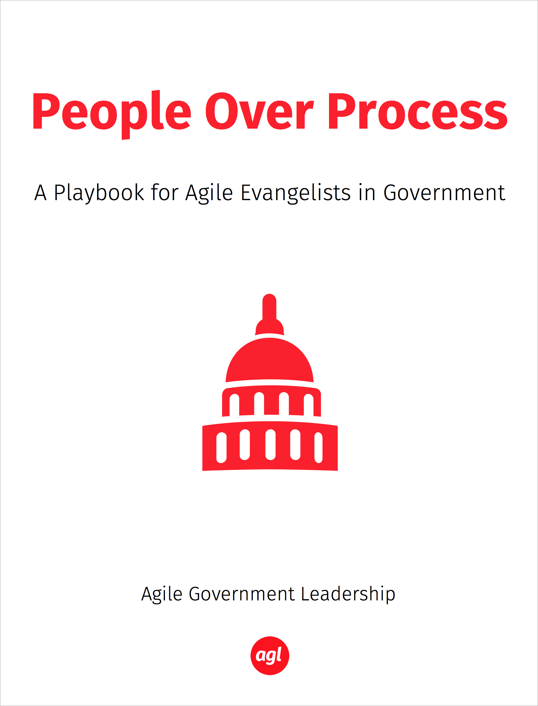

# People over Process

A Playbook for Agile Evangelists in Government

*By [Agile Government Leadership](http://agilegovleaders.org) (and friends)
*

## Introduction

During the first half-dozen interviews with agile evangelists in government, we heard a common theme:

* "He just doesnt get it." 
* "We need to wait till he retires." 
* "It is impossible to change this place."

Quick to jump to a fix, people asked for tools and processes. We almost followed that urgent request, but then we stepped back and looked beneath the surface of the frustrations and desires.

During that first sprint to write this book, we reviewed the **first** value listed in the Agile Manifesto: **Individuals and Interactions over process and tools**. We immediately saw that value in a different light.

### Changing Culture

It became even more clear that changing culture was critical to the adoption of agile in government. Of course there are very real policy and legal barriers to overcome as well. Fortunately, there are many incredible people inside government who are creating avenues to adopt agile. This includes work like the TechFar, which shows the path to procuring agile in government.

While this book will include many of these tools and processes that have been documented by 18f, US Digital Service, and other initiatives, we will pay close attention to individuals and interactions and how to implement various agile practices with empathetic human interactions.

While Agile development has an advantage over Waterfall, it fails when organizations can't adapt to change. According to Standish Group study, only 34% of change projects are successful. Further studies by Kotter, McKinsey, Prosci and others indicate that people related problems are responsible for 60% of the failures. 

This research indicates that employee attitudes and management behavior appears to be the cause. As Jason Little wrote in his book "Lean Change Management" - it's the "unpredictable nature of those pesky humans." We are looking to make this more predictable for you.

### Accessible Continuous Integration

This book, like many agile development projects, is an ongoing project. Our intention is to co-create an evolving book with a community of evangelists. We invite your participation on gitbook.

The current primary organizational structure of this book is by job titles (or roles). The following is our roadmap along with status:

1. ScrumMaster (In Process)
2. Product Owner (Backlog)
3. Chief Officer (Backlog)
4. Contracting Officer (Backlog)
5. Security Officer (Backlog)
6. Legal Officer (Backlog)

### Getting It!

Helping others "get it" begins with each of us.

During the second sprint on this book, we dug into current research on neuroscience and human change. We found keys to understanding and influencing human behavior.

In the book 'Neuroscience for Leadership', Tara Swart writes about how the brain stitches together reality from the bits we perceive and process. We try to put together an entire story with parts and as a group end up with a multiplicity of interpretations.

Our brains are highly selective in what we pay attention to. The assigning of meaning happens subconsciously and we are often not aware of meaning because of a lack of context. For example xxxx (tony add something here).

The intention of this work is to pay attention to and document successful human interactions around agile in government. We intend to build a body of work that can help everyone better understand how others see things such that we can improve our ability to provide useful **and delightful** digital services to government workers and the public.

It is our intention that the book will provide value to each of us, the reader and contributor without focusing on making others 'get it'. We hope to empower each of us to change interactions by and among others by transforming ourselves.

