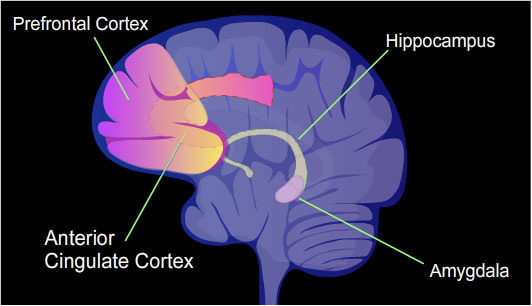

# Neuroscience

## Wiring
The field of neuroscience shows us that a large part of human behavior is actually hard-wired into our system through set patterns of neural flow in the brain that scientists refer to as neuropathways. Think of these pathways as railroad tracks and your thoughts as rail cars ensuring that you engage in the same, predictable patterns of behavior over and over again.

One thing that we are all hard-wired for is survival and these pre-programmed patterns of behavior are designed to save your life. When your system detects a serious threat, your biology kicks into high gear driving a fight or flight response, which we do completely without conscious thought. This is why when people survive a near-death experience they often struggle to recall what even happened.

Interestingly, this hard-wired pattern of behavior is more easily triggered than you might think and your survival strategy is employed in lots of situations when there is no actual threat to your life.

And, this isn't just happening to you, it's also going on in the people around you all the time.

## Beyond Survival
One of the primary things separating the human experience from the animal kingdom is that we humans have developed an extraordinary capacity to experience multiple types of pressure (or risk) in our lives, which is to say we carry many different levels of concern beyond survival.

Animals really only deal with pressure associated with threats to their lives, so our evolution is no small feat given that we share the same biological imperative for survival as our animal counterparts.

Humans have advanced to the point where survival ranks as only one of our primary concerns. And while it remains a very important one, we also put a lot of our attention on what other people think about us and how that impacts our ability to earn a living, advance our careers, fina a partner and build a healthy community.

And while we have expanded our capacity for the things that concern us, our method for handling them remains pretty much the same. This is because our brain has a really hard time distinguishing between actual risk (threat of death) and perceived risk (threat of humiliation) and we are hard-wired to respond in a particular way.

This is where the neuroscience provides a fascinating explanation for what is going on.

## Losing Your Mind

The human brain is the most powerful processor on the planet, responsible for incredible advances in art, culture, technology. Yet, at times it can cause us to act like animals. 

Here's how it works. Our brains are comprised of three primary areas, working from the inside out:
* The most primitive part of the brain is called the amygdala. It is the first part of the brain that forms in utero, it's about the size of an almond and it sits at the base of the brain stem. Its primary role is to act as a human highlighter, constantly scanning your environment for potential threats. It is sometimes referred to as the "lizard brain" because it is the only brain that a reptile has (also found in the brains of all animals).

* The amygdala resides inside of the wider limbic system, which is the area of our brains responsible for our basic drive for things such as hunger, sex, dominance, care for offspring, as well as the place where we experience emotions, moods, motivation and also where our instinct comes from. The limbic system is also the storage area for long-term memory, which is relevant because it explains why many of our memories tend to be more emotionally-based than factual.

* Finally, at the outermost layer you will find the neocortex, which is the largest and most complex part of the human brain. The neocortex is involved with all higher functions such as sensory perception, spatial reasoning, language and complex thought. It's where things like art, science and culture live in us. It could be argued that the neocortex is the thing that makes us uniquely human. That is, until the moment we experience pressure.

When exposed to a high enough level of pressure, for instance when you find yourself with 2 more hours of work to do on a project that is due in 30 minutes or when you are being asked by the press to comment on an emerging scandal in your office, the human brain loses its ability to distinguish between actual and perceived risk causing the amygdala to kick into high gear to protect you from the threat.

Within milliseconds, a potent cocktail of neurochemicals floods your brain in an attempt to ensure your survival. Serotonin is shot into the neocortex in order to pacify your higher level mental processing, then the limbic system receives doses of dopamine, which reduces inhibitions, and adrenaline, which is like caffeine on caffeine.

In this moment, the most primitive part of your brain is essentially being encouraged to do whatever it wants as fast as it can, which is to defend your life. Your heart starts racing, you break out in a sweat, your breath shallows, and you quite literally lose your mind.

So, while we humans are advanced beings living in a modern world, it turns out we are still operating on a fairly primitive biology. And under pressure, that biology predictably runs your hard-wired survival strategy every time it detects a threat.

## Mirror Neurons

And, this survival response doesn't remained contained inside of a person's own experience. Neuroscience research shows that the underlying emotions are transmitted to others around us through a mimicking device in our brains called mirror neurons, which allow us to experience other people's emotions as if they were our own. 

So, when one person become threatened, others around that person pick up on the emotional state of threat. In other words, triggered people trigger other people as a community-based survival strategy to address the supposed threat.

However, if you pay attention, you will find that most of the time this happens, your life isn't actually at stake. And if you can begin to see this pattern in others, you can use that information to dramatically improve your ability to interact and work with them.

